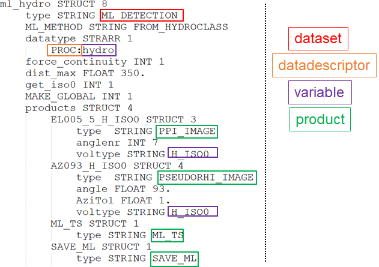

.. _API:

####################
Features
####################

:Release: |version|
:Date: |today|

This guide provides an overview of all available Pyrad features. 
It gives as list of all possible dataset and products types, as well as all variable names and datadescriptors that are currently supported.

Remember that pyrad relies on the sequential processing of datasets. An example of dataset is shown in the image below. This dataset is called *ml_hydro* which is an arbitrary user-chosen name and is of type *ML_DETECTION*. 
This dataset uses a previously computed hydrometeor classification as input. It relies on the *PROC* datadescriptor and uses the variable *hydro*. It then generates four different products. which all have arbitrary names and are of the types 
*PPI_IMAGE*, *PSEUDORHI_IMAGE*, *ML_TS* and *SAVE_ML*. Some products apply only to specific variables (voltype), for example *PPI_IMAGE* and *PSEUDORHI_IMAGE* use the variable *H_ISO0* for the plots.

Note that datasets types are separated by the nature of their output object (e.g. VOL, GRID, SPECTRA,...).
For every output object type, a certain number of products can be generated. Hence similarly, all available product types are separated by the nature of the dataset output object to which they apply.

To take an example, the ATTENUATION dataset returns an object of the VOL type. For the VOL type, many products are available, for example CAPPI_IMAGE or PPI_MAP, but not SURFACE_RAW (for example) which is a product that operates on GRID objects only.

.. toctree::
   :maxdepth: 1

   list_process
   list_products
   list_datadescriptors.rst
   list_variables
