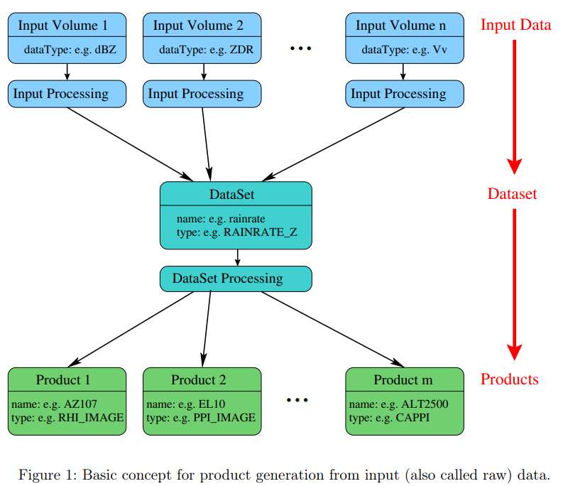

Product configuration file
==============================

The concept of product configuration files is based on three stages: 1. input or raw data volume, 2. datasets and 3. products.
The center point of the data processing is the dataset. A dataset can be generated from one
or more than one input data volumes (e.g. a rainrate dataset uses 5 different raw data volume
to be generated).
There are several different formats of a dataset. For example, a dataset can be a volume, a
trajectory, a volume composite or a time series. Section 5 summarizes the possible datasets.
From a dataset the products are generated. What products can be generated from a dataset
depends on the type (volume, volume composite, trajectory or time series) of the dataset.
The figure below shows a schema of an example of the basic concept of the product generation. From
different input data a dataset is generated and from this dataset m products are created.

  
pyrad relies on the sequential processing of datasets. An example of dataset is shown in the image below. This dataset is called *ml_hydro* which is an arbitrary user-chosen name and is of type *ML_DETECTION*. 
This dataset uses a previously computed hydrometeor classification as input. It relies on the *PROC* datadescriptor and uses the variable *hydro*. It then generates four different products. which all have arbitrary names and are of the types 
*PPI_IMAGE*, *PSEUDORHI_IMAGE*, *ML_TS* and *SAVE_ML*. Some products apply only to specific variables (voltype), for example *PPI_IMAGE* and *PSEUDORHI_IMAGE* use the variable *H_ISO0* for the plots.

.. image:: pyrad_explanation_names.png
  :width: 400
  :alt: Explanation of the pyrad type names

Note that datasets types are separated by the nature of their output object (e.g. VOL, GRID, SPECTRA,...).
For every output object type, a certain number of products can be generated. Hence similarly, all available product types are separated by the nature of the dataset output object to which they apply.

To take an example, the ATTENUATION dataset returns an object of the VOL type. For the VOL type, many products are available, for example CAPPI_IMAGE or PPI_MAP, but not SURFACE_RAW (for example) which is a product that operates on GRID objects only.

.. toctree::
   :maxdepth: 1

   list_process
   list_products
   list_datadescriptors.rst
   list_variables
